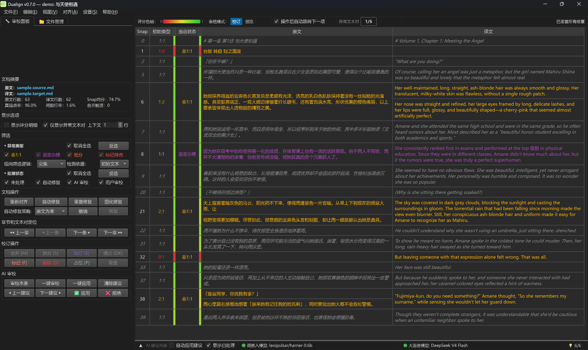
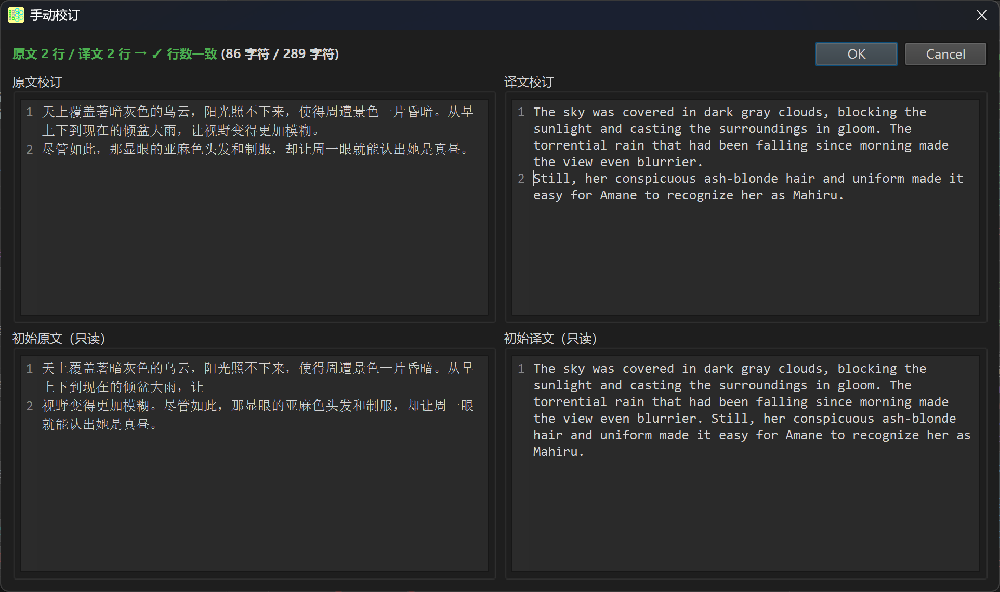
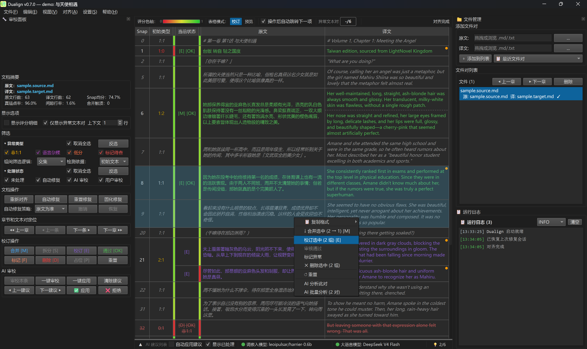

# Dualign 

> **双语平行文档对齐与 AI 辅助校验工具**

Dualign 是一款面向**行级（段落级）双语平行语料**的智能对齐与审校系统。它将原文与译文精确对齐到行级别，自动修复结构性错位，并通过大语言模型辅助语义审校，最终在交互式 GUI 工作台中完成人工终审。

如果你曾因翻译工具的**输出行数不一致**而苦恼，或者手动调整双语对照文本**耗费数小时**——Dualign 就是为你准备的。


_启动欢迎页：包含程序图标、标题、功能定位。卡片显示嵌入模型和 AI 模型运行状态_

---

## 🎯 能解决什么问题？

| 你的痛点                                    | Dualign 的解法                                 |
| ------------------------------------------- | ---------------------------------------------- |
| 翻译 API 输出行数和原文对不上（合并、拆分） | 嵌入向量 + 动态规划自动对齐，支持任意 N:1、1:M |
| 原文有内容但译文缺失（漏译）                | 自动检测 N:0 缺失，标记占位符或删除            |
| 译文有内容但原文没有（多译）                | 自动检测 0:M 多余，标记为占位符或删除          |
| 自动修复不放心，需要人工确认                | GUI 工作台逐行审校，支持合并/拆分/编辑/标记    |
| 篇章太长，异常太多，审不过来                | AI 代理自动审校异常对，人类只需终审            |
| 改错了想撤回                                | 任意操作可撤销/恢复，支持到最近 50 步          |
| 几十个文件要批量对齐                        | 批量发现 + 一键修复 + 导出，流程化处理         |

---

## ✨ 功能全景

### 🧩 L1 — 智能对齐引擎

- **嵌入向量编码**：通过嵌入模型（Ollama / LM Studio / 兼容 API）将句子转为语义向量
- **全量相似度矩阵**：一次计算所有行对之间的余弦相似度
- **双边信任余量真锚点搜索**：源侧和目标侧各自计算信任余量，仅递归 LIS 双向最优近似对成为真锚点，天然杜绝错配级联
- **Phase 1→5 流水线**：递归真锚点 → 赝锚点补全 → 合并枚举 → 批量编码 → 单一 DP，支持 N:1（合并）、1:M（拆分）、N:0（缺失）、0:M（多余）
- **合并组合上限 (θ=20)**：单次合并最大跨度不超过 θ，避免低信噪比区域的错误合并

### 🔧 L2 — 规则自动修复

- **三种策略**：原文优先 / 译文优先 / 最小信息量（不引入新内容）
- 自动处理所有非 1:1：合并孤行、拆分对应、占位缺失、删除多余
- 拆分操作附带**完整子对齐管线**（非简单标点切割）

### 🤖 L3 — AI 语义审校

- **Tool-calling 代理**：AI 按需拉取文本对详情，而非一次性传入全部
- 嵌入编码支持 Ollama / LM Studio / 自定义 API 多种后端
- 零 token 浪费：正常 1:1 文本对不出现在请求中
- 实时反馈：GUI 中可看到 AI 的思考过程和决定
- AI 建议可逐条**采纳或拒绝**，所有 AI 操作同样可撤销

### 🖥️ L4 — 交互式 GUI 工作台


_校订模式核心工作台：左侧审校面板（筛选/操作/AI审校），中央7列表格显示异常文本对，灰色行为1行上下文_

- **7 列对齐表格**：Snap 编号、初始/当前类型、初始/当前评分、原文、译文
- **双轴异常筛选**：异常类型（客观属性）× 审批状态（用户行为），正交 AND 组合
- **操作面板**：合并、拆分、编辑、删除、占位符、标记、确认
- **AI 建议卡片**：逐条展示 AI 的审校决定，一键采纳/拒绝
- **工作区管理**：多文件对同时打开，切换即审
- **完整键盘快捷键**：覆盖所有常用操作


_手动校订对话框：2:1 文本对调整为 2:2，上下分区展示编辑区和初始参考区_


_双栏布局下选中多个异常对，右键菜单展示批量操作项（合并选中/校订选中/删除选中）_

### 🔄 不可变状态 + 无限撤销

- `RepairState` = 不可变快照 + append-only 操作日志 + 纯函数 `replay()`
- `undo()` 只需移除日志最后一条——无需命令栈、无需逆操作
- 导出 `report.json` 可完整恢复修复进度

---

## 👤 适用场景

| 场景                         | 适用度 | 说明                       |
| ---------------------------- | ------ | -------------------------- |
| **轻小说/网文中→英平行阅读** | ⭐⭐⭐ | 最初为此设计，完美契合     |
| **翻译质量检查**             | ⭐⭐⭐ | 找出缺失、多余、错位       |
| **双语字幕对齐**             | ⭐⭐⭐ | 行级对齐，语言无关         |
| **平行语料库构建**           | ⭐⭐⭐ | 批量处理 + 质量筛选        |
| **NMT 后处理**               | ⭐⭐   | 修复翻译 API 的行数不一致  |
| **双语合同/法律文档对照**    | ⭐⭐   | 精确到行级，可逐行审核     |
| **实时翻译**                 | ❌     | 非实时系统                 |
| **词级/短语级对齐**          | ❌     | 仅行级（段落级）           |
| **非平行文档**               | ❌     | 需要原文和译文大致结构对应 |

---

## 🏗 架构一览

```text
                        输入: 原文.md + 译文.md
                                  │
    ┌─────────────────────────────┼─────────────────────────────┐
    │                             ▼                             │
    │  L1 对齐引擎         嵌入编码 (Ollama / LM Studio / API)    │
    │                      余弦相似度矩阵                       │
    │                      Phase 1→5 流水线                     │
    │                    递归真锚点→赝锚点→合并枚举→DP        │
    │                      ──→ AlignmentSnapshot               │
    │                             │                             │
    │                             ▼                             │
    │  L2 自动修复          规则流水线                          │
    │                      策略矩阵 (src/tgt/minimal)           │
    │                      合并/拆分/占位/删除 ──→ RepairState  │
    │                             │                             │
    │                             ▼                             │
    │  L3 AI 审校           Tool-calling 代理                   │
    │                      examine → context → review           │
    │                      DeepSeek API 后端                    │
    │                             │                             │
    │                             ▼                             │
    │  L4 交互式 GUI        PySide6 工作台                      │
    │                      7 列表格 + 筛选 + 操作 + AI 建议     │
    │                      人工终审 ──→ 导出                    │
    └─────────────────────────────┼─────────────────────────────┘
                                  │
                        输出: 逐行对照的 1:1 文本对
```

**核心设计原则**：

- **不可变快照**：原始对齐结果永不修改，所有操作通过索引引用
- **纯函数核心**：对齐引擎、修复逻辑均为纯函数，可独立单元测试
- **双轴正交**：异常类型（数据属性）与审批状态（用户行为）完全分离
- **info-free vs info-full**：合并/删除等仅存标记，拆分/编辑才存完整文本

---

## 🚀 快速开始

### 环境要求

| 依赖                  | 用途         | 必须？        |
| --------------------- | ------------ | ------------- |
| **嵌入后端服务**      | 句子嵌入编码 | ✅ 必须选其一 |
| → Ollama（默认·免费） | 本地推理     | 🟢 推荐       |
| → LM Studio           | 本地推理     | 🟢 可选       |
| → OpenAI 兼容 API     | 云端服务     | 🟢 可选       |
| Python ≥ 3.10         | 运行环境     | ✅ 必须       |
| DeepSeek API Key      | AI 审校      | ❌ 可选       |

### 安装

```bash
# 克隆仓库
git clone <repo-url>
cd dualign

# 创建虚拟环境（推荐）
python -m venv venv
venv\Scripts\activate     # Windows
source venv/bin/activate  # macOS / Linux

# 安装 Dualign
pip install -e .
```

| 安装方式              | 包含                                  | 体积   |
| --------------------- | ------------------------------------- | ------ |
| `pip install dualign` | 对齐引擎 + CLI + AI 审校 + GUI 工作台 | ~90 MB |

> GUI 工作台（PySide6）已包含在核心安装中，无需额外配置。

### Windows 用户：安装包 / 便携版（替代方案）

如果你不想安装 Python 环境，可从 [Releases](https://github.com/LoveElysia1314/Dualign/releases) 直接下载：

| 文件                          | 说明                                       | 适合                  |
| ----------------------------- | ------------------------------------------ | --------------------- |
| `Dualign_Setup_v0.7.0.exe`    | Inno Setup 安装包，自动注册 `dualign` 命令 | 习惯安装向导的用户    |
| `Dualign_Portable_v0.7.0.zip` | 便携版 ZIP，解压即用，免安装               | 纯 GUI 用户、U 盘携带 |

> 打包版本不包含 Python 环境。首次使用仍需安装 Ollama 并拉取默认嵌入模型。

### 配置嵌入后端

Dualign 默认使用 **Ollama**（免费，零配置启动）作为嵌入后端。也支持 LM Studio 和任意 OpenAI 兼容 API（硅基流动、DeepSeek Embedding 等），可在 GUI 设置面板中随时切换。

#### 选项 A：Ollama（默认，推荐）

```bash
# 安装：https://ollama.ai
ollama serve                              # 启动服务
ollama pull leoipulsar/harrier-0.6b      # 拉取默认嵌入模型
```

> **模型推荐**：`leoipulsar/harrier-0.6b`（默认，基于 Qwen3-embedding，0.6B 参数）编码 100 行文本约 3-5 秒，适合大多数场景。
> 12 GB+ 显存用户可选 `qwen3-embedding:4b-q4_K_M`，质量更高但耗时约 3 倍。
> 也支持任何 Ollama 嵌入模型：设置 `DUALIGN_MODEL=ollama:模型名` 即可切换。

#### 选项 B：LM Studio

1. LM Studio 中加载嵌入模型（如 `codefuse-ai/F2LLM-v2`）
2. 启动本地推理服务器（默认 `http://localhost:1234`）
3. 在 GUI 设置 → 模型配置中选择 "LM Studio"

#### 选项 C：自定义 OpenAI 兼容 API

适用于硅基流动、DeepSeek Embedding 等云端服务。在设置面板中配置 `base_url`、`model_name` 和 API Key 即可。

### 启动 GUI

```bash
python -m dualign gui                    # 启动工作台
python demo/demo_gui.py                  # 加载示例数据
```

### 命令行快速对齐

```bash
# 对齐 + 自动修复 + 导出
python -m dualign -s 原文.md -t 译文.md -o output/

# 修复策略：src（原文优先）/ tgt（译文优先）/ minimal（最小修改）
python -m dualign -s 原文.md -t 译文.md --strategy minimal
```

### 批处理工作流

Dualign 可无缝嵌入你的批量管线：

```python
from dualign.services.cli_pipeline import align_chapter

file_pairs = [("ch01.source.md", "ch01.target.md"), ...]
for src, tgt in file_pairs:
    result = align_chapter(src_path=src, tgt_path=tgt, output_dir="output/")
    print(f"{src} → {'✓' if result['success'] else '✗'}")
```

→ 三种集成模式（串行 / 回调 / 并行）见 [batch 示例](demo/batch/README.md)

### 作为 Python 库使用

```python
from dualign import RepairService
from dualign.services.embedding import load_model_for_provider

# 自动加载当前激活的提供方（默认 Ollama harrier-0.6b）
model = load_model_for_provider()

src_out, tgt_out, scores = RepairService.align_and_repair(
    ["第一章", "内容段落 A", "内容段落 B"],
    ["Chapter 1", "Content Para A"],
    model,
    strategy="minimal",
)
# → (["第一章", "内容段落 A", "内容段落 B"],
#    ["Chapter 1", "Content Para A", ""],
#    [0.92, 0.85, 0.0])

# 也可直接指定编码器：
# from dualign.services.embedding import OllamaEncoder, OpenAICompatibleEncoder
# model = OllamaEncoder("leoipulsar/harrier-0.6b")
# model = OpenAICompatibleEncoder("http://localhost:1234", "your-model", api_key="...")
```

---

## 📚 进一步阅读

| 文档                                           | 内容                                    |
| ---------------------------------------------- | --------------------------------------- |
| [快速入门](docs/quickstart.md)                 | 5 分钟上手 Dualign                      |
| [GUI 使用指南](docs/user-guide.md)             | 交互式工作台详细操作说明                |
| [技术架构 / API / 数据格式](docs/reference.md) | 核心类、设计模式、API、report.json      |
| [算法深度解析](docs/algorithm.md)              | 对齐引擎的数学推导、核心假设            |
| [AI Agent 指南](docs/ai-agent-guide.md)        | AI 审校代理设计、工具接口、提示词       |
| [开发指南](docs/development.md)                | 环境搭建、测试、打包发布                |
| [批处理集成](demo/batch/README.md)             | 将 Dualign 嵌入批处理工作流的三段式教学 |

---

## 📄 许可证

MIT License — 详见 [LICENSE](LICENSE)。

---

_Dualign — 让双语平行文本的每一行，都找到它的另一半。_
