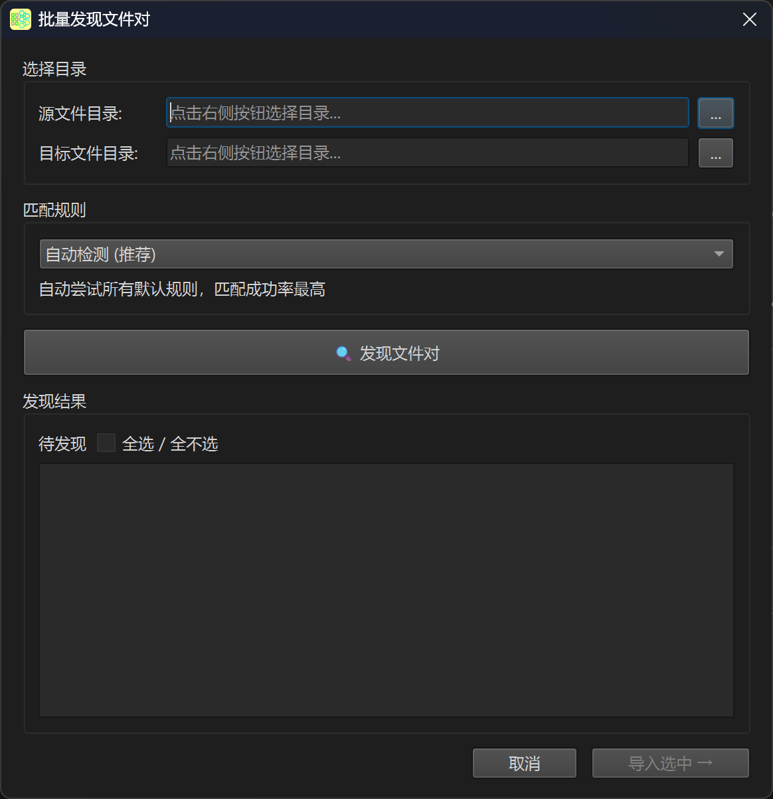
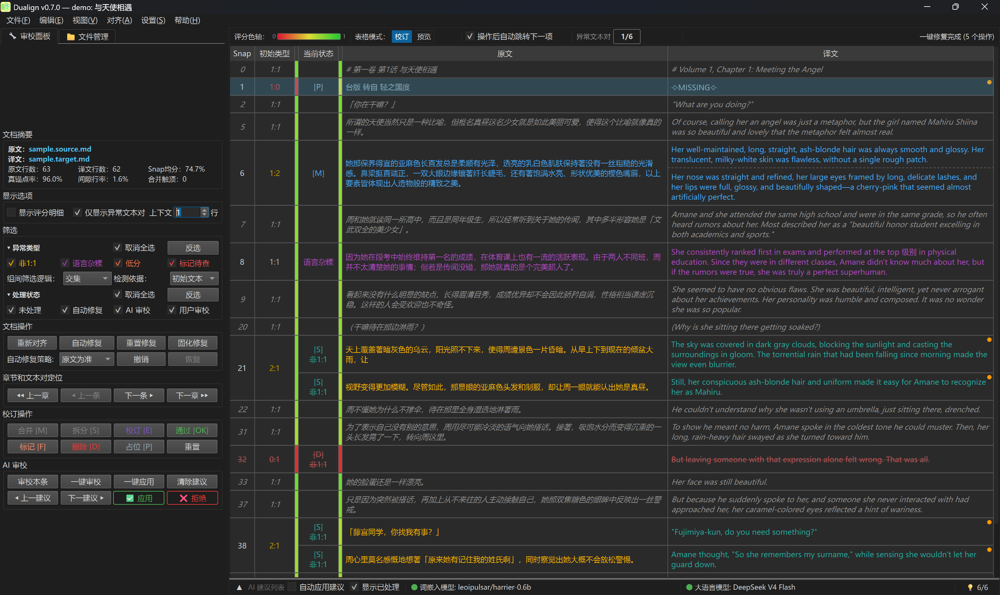
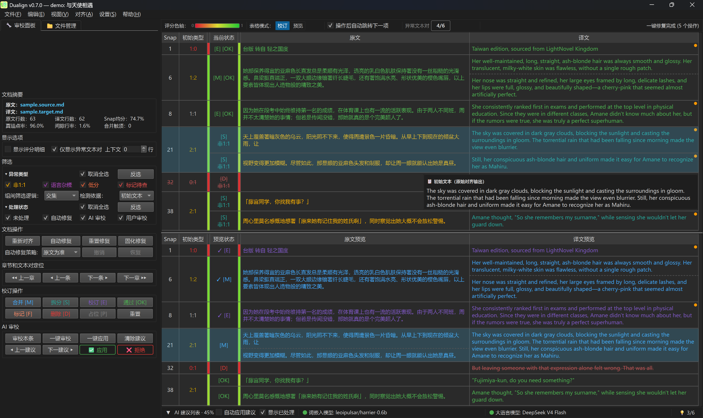
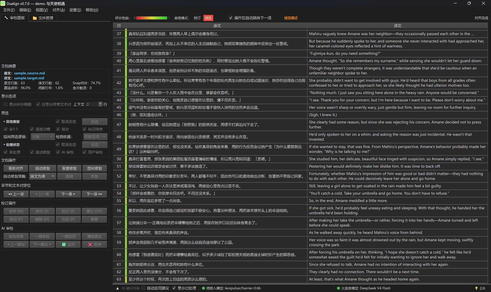
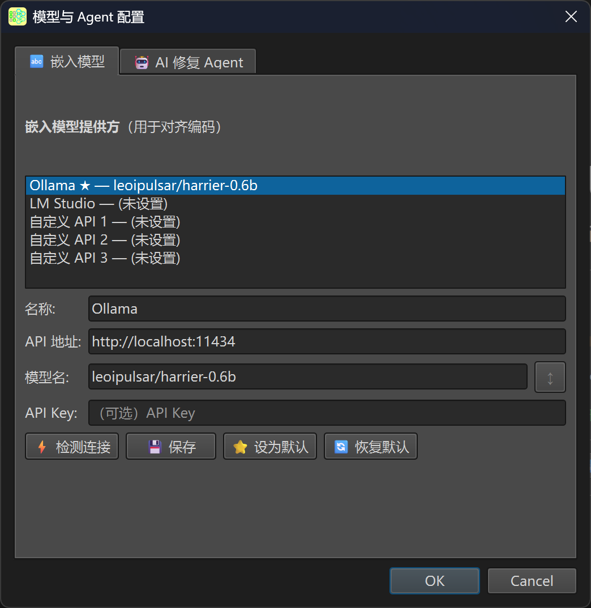
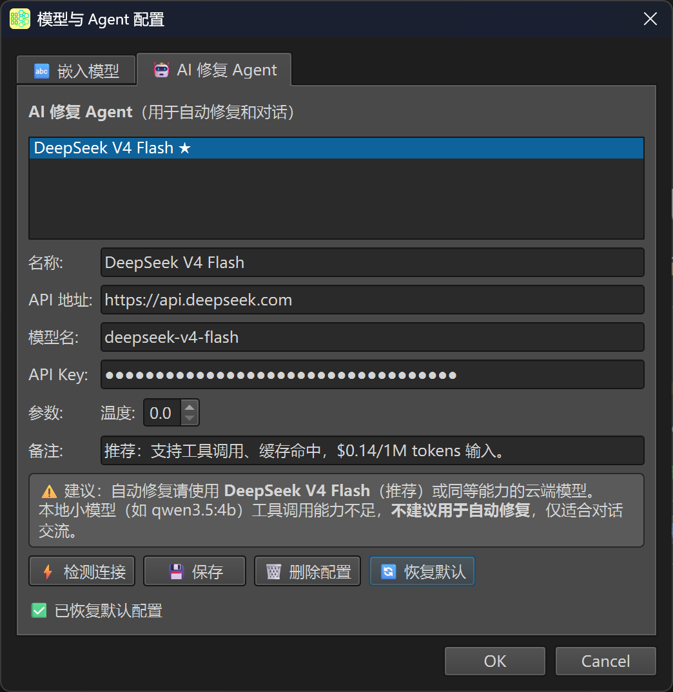
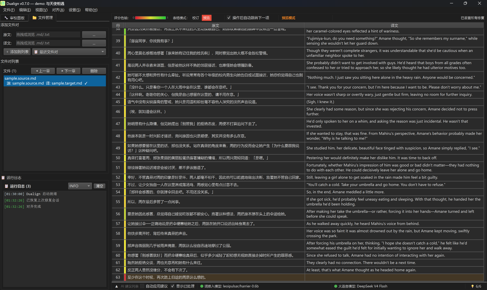

# Dualign GUI 使用指南

> 版本 0.7.0 — 面向交互式工作台的用户

---

## 目录

1. [欢迎页与初始设置](#1-欢迎页与初始设置)
2. [加载文件](#2-加载文件)
3. [对齐表格](#3-对齐表格)
4. [筛选与导航](#4-筛选与导航)
5. [手动修复操作](#5-手动修复操作)
6. [AI 智能审校](#6-ai-智能审校)
7. [导出结果](#7-导出结果)
8. [设置面板](#8-设置面板)
9. [键盘快捷键](#9-键盘快捷键)
10. [工作区与批量处理](#10-工作区与批量处理)

---

## 1. 欢迎页与初始设置

首次启动 Dualign 时，你会看到欢迎页。它引导你完成三步：


_启动欢迎页：包含程序图标、标题、功能定位。卡片显示嵌入模型和 AI 模型运行状态_

### 1.1 检查嵌入后端状态

Dualign 需要嵌入后端（默认 Ollama）提供句子编码。欢迎页自动检测：

- 后端服务是否运行
- 默认嵌入模型是否已拉取

如果状态指示灯为红色，点击它可复制安装命令到剪贴板。

### 1.2 配置 AI 审校（可选）

在设置面板的"模型与 Agent 配置"中输入 DeepSeek API Key，或通过环境变量设置：

```bash
$env:DEEPSEEK_API_KEY = "sk-your-key-here"
```

> AI 审校目前仅支持 DeepSeek API。Ollama 仅作为嵌入编码后端。

### 1.3 打开文件或 Demo

点击"打开文件对"选择原文和译文，或点击"打开 Demo"加载示例。

---

## 2. 加载文件

| 方式       | 快捷键         | 说明                     |
| ---------- | -------------- | ------------------------ |
| 打开文件对 | `Ctrl+O`       | 手动选择源文件和目标文件 |
| 批量发现   | `Ctrl+Shift+O` | 自动扫描目录中的文件对   |
| 打开 Demo  | `Ctrl+D`       | 加载内置示例数据         |

### 批量发现规则

支持的匹配规则：glob 通配符、前缀匹配、正则捕获、JSON 映射。


_批量发现文件对（初始空状态）：选择目录、匹配规则预设、一键发现_

---

## 3. 对齐表格


_校订模式（修复前）：中央7列表格展示异常文本对（含非1:1/语言杂糅/低分等），左侧筛选面板全部勾选，上下文1行（灰色字体）_

| 列  | 名称     | 说明                                     |
| --- | -------- | ---------------------------------------- |
| 0   | Snap     | 文本对编号（始终指向原始对齐结果）       |
| 1   | 初始类型 | 对齐引擎原始判断，如 `1:1`、`3:1`、`2:0` |
| 2   | 初始评分 | 余弦相似度（0–100%）                     |
| 3   | 当前类型 | 修复后的实际类型，通常为 `1:1`           |
| 4   | 当前评分 | 修复后评分                               |
| 5   | 原文     | 源语言文本                               |
| 6   | 译文     | 目标语言文本                             |

### 操作标记

| 标记   | 含义       | 产生者                 |
| ------ | ---------- | ---------------------- |
| `[M]`  | 已合并     | 自动修复 / 手动 / AI   |
| `[S]`  | 已拆分     | 自动修复               |
| `[E]`  | 已校订     | 手动 / AI              |
| `[D]`  | 已删除     | 自动修复 / 手动 / AI   |
| `[P]`  | 占位符     | 自动修复               |
| `[F]`  | 已标记异常 | 手动 / AI              |
| `[OK]` | 已确认无误 | 手动 / AI              |
| `[AI]` | AI 处理过  | AI（叠加在其他标记前） |

> 标记可以叠加。例如 `[AI][M]` 表示 AI 执行的合并，`[AI][M] [OK]` 表示 AI 合并后已通过审批。`[AI]` 前缀始终在最前面。

### 颜色编码

**评分列**：使用从红到绿的连续渐变（RdYlGn 色板）：0 为红色，0.5 为黄色，1 为绿色。不设离散阈值。

**操作标记颜色**：

| 标记        | 颜色   | 含义                   |
| ----------- | ------ | ---------------------- |
| `[M]` 合并  | 蓝色系 | 多行合并为一行         |
| `[S]` 拆分  | 蓝色系 | 一行拆分为多行         |
| `[E]` 校订  | 青色系 | 文本内容被修改         |
| `[D]` 删除  | 红色系 | 行已删除（灰色删除线） |
| `[P]` 占位  | 蓝色系 | 缺失侧填入 `⟢MISSING⟣` |
| `[AI]` 前缀 | 紫色   | AI Agent 处理过        |

**异常类型颜色**（在 Snap 列左侧以颜色条标识）：

| 异常类型      | 颜色    | 含义                 |
| ------------- | ------- | -------------------- |
| 非 1:1 文本对 | 🟠 橙色 | 对齐类型不是 1:1     |
| 语言杂糅风险  | 🟣 紫色 | 文本混入另一种语言   |
| 低分          | 🟡 金色 | 相似度统计离群       |
| 手动标记异常  | 🩷 粉色 | 用户或 AI 标记为异常 |

**文本变化着色**：

- **校订过的文本**：使用对应操作标记的颜色突出显示（如 [E] 标记的行为青色）
- **删除的行**：灰色文字 + 删除线
- **上下文行**（异常对周围的非异常行）：浅灰色文字
- **选中行**：半透明蓝色背景高亮

**合并行** `[M]` 的子行之间显示虚线分隔。

### 3.1 底部状态栏

表格上方有一条四区状态栏，从左到右：

```text
① 分数渐变色轴 ─ ② 定位器 ─ ③ Snaps 信息 ─ ④ 消息
```

| 区       | 内容                               | 说明                  |
| -------- | ---------------------------------- | --------------------- |
| ① 分数轴 | 红→黄→绿渐变色条，标注 0%/50%/100% | 评分颜色的参考图例    |
| ② 定位器 | 如 "异常 3/15"                     | 当前异常序号/总异常数 |
| ③ Snaps  | 如 "snap 25,26,27"                 | 当前选中的文本对编号  |
| ④ 消息   | 如 "对齐完成"                      | 最近操作的状态文本    |

表格下方还有一条始终可见的**底部栏**（紧贴窗口底边）：

| 组件                      | 说明                                                                |
| ------------------------- | ------------------------------------------------------------------- |
| ▼/▲ 按钮                  | 展开/折叠底部 AI 建议面板                                           |
| 词嵌入模型指示灯 🟢/⚪/🔴 | 嵌入后端（Ollama/LM Studio）状态：绿色=就绪，灰色=未检测，红色=异常 |
| 大语言模型指示灯 🟢/⚪/🔴 | AI 审校 Agent 状态：绿色=已配置 API Key                             |
| AI 建议计数               | 当前待处理的 AI 建议数量                                            |

> 底部 AI 建议面板展开时显示 AI 建议的预览表格。在多个文件间切换时，该面板在最窄时自动折叠。
>
> 💡 **预览模式**：点击 StatusBar 的「预览」按钮可切换到 4 列模式（行号/原文/译文），适合专注阅读内容。预览模式下审校面板操作按钮全部锁定。详见[§7 导出结果](#7-导出结果)的截图展示。

---

## 4. 筛选与导航

### 4.1 异常类型筛选（轴 1）

筛选面板位于左侧 dock，与审校操作面板集成在同一区域：


_左侧 dock 包含文档摘要、显示选项、筛选（异常类型×处理状态）、文档操作、校订操作、AI审校六大区域_

| 异常类型      | 含义                       |
| ------------- | -------------------------- |
| 非 1:1 文本对 | 对齐后类型不是 1:1         |
| 语言杂糅风险  | 文本中可能混入另一种语言   |
| 低分          | 相似度统计离群             |
| 手动标记异常  | 用户或 AI 标记为需人工处理 |

### 4.2 处理状态筛选（轴 2）

| 状态     | 含义                     |
| -------- | ------------------------ |
| 未处理   | 还没有任何操作           |
| 自动修复 | 自动修复已处理，等待确认 |
| AI 审校  | AI 审校已处理            |
| 用户审校 | 用户已确认/修改          |

**两轴正交**：同组内勾选多项用 OR 组合，两轴之间默认 AND，可在筛选面板切换为 OR。

### 4.3 上下文行

启用"显示上下文"后，每个异常对前后显示 N 行（默认 1 行）上下文。

### 4.4 空状态页

当筛选条件下没有任何异常文本对时，表格区域会显示**空状态页**——一个大号 ✅ 图标 + "全部对齐无误"提示 + 「显示全部文本对」按钮。点击该按钮可清除筛选，查看所有文本对。

### 4.5 键盘导航

- **↑/↓**：上下移动选中行
- **PageUp/PageDown**：翻页
- **Home/End**：跳到首/尾
- **Ctrl+G**：输入 Snap 编号直接跳转

完整快捷键表见[第 9 节](#9-键盘快捷键)。

---

## 5. 手动修复操作

选中一个或多个文本对后，右键菜单或审校面板提供以下操作：


_自动修复完成（非AI）：标记包括 [P]占位（蓝底）、[M]合并（蓝色）、[S]拆分（青色）、[D]删除（红色删除线），评分明细列可见_

> 一键自动修复可处理所有非 1:1 异常，建议作为 AI 审校前的第一步。

### 5.1 合并 `[M]`

**适用场景**：多行原文对应一行译文（N:1），或一行原文对应多行译文（1:M）。

> info-free 操作：只存标记，文本仍在原始快照中。

### 5.2 拆分 `[S]`

**适用场景**：一行长句对应多行短句。需要嵌入模型支持。

按标点符号将少行侧拆分，重新运行对齐管线匹配多行侧。

> info-full 操作：拆分结果完整存储。

### 5.3 校订 `[E]`

**适用场景**：文本内容有误。弹出编辑对话框，可修改原文、译文或两者。


_手动校订对话框：2:1 文本对被调整为 2:2。上排编辑区（带行号可编辑），下排初始参考区（灰色只读），顶部显示行数一致 ✓_

> 初始参考区保留了修改前的原始内容供对比。行数不一致时 OK 按钮禁用。

### 5.4 删除 `[D]`

**适用场景**：多余行需要移除。删除的行保留但显示灰色删除线。

### 5.5 占位符 `[P]`

**适用场景**：原文存在但译文缺失（1:0），需要保留位置。填入 `⟢MISSING⟣`。

### 5.6 标记异常 `[F]`

**适用场景**：不确定如何处理，标记为待定。支持添加备注。

### 5.7 确认无误 `[OK]`

将文本对从"待审批"移动到"已处理"。

### 5.8 跨 Snap 合并

选中多个相邻的 snap（`Ctrl+点击` / `Shift+点击`），右键合并为捆绑组。

### 5.9 右键菜单

在表格中**右键点击**文本对，弹出上下文菜单，包含：


_双栏布局下选中2个异常对右键菜单：批量操作项（⤓合并选中 / 校订选中 / 删除选中）均显示操作数量_

| 菜单项                                       | 说明                                       |
| -------------------------------------------- | ------------------------------------------ |
| 复制格式 → Markdown 表格                     | 将选中行复制为 `\|` 分隔的 Markdown 表格   |
| 复制格式 → TSV                               | 将选中行复制为制表符分隔的文本             |
| 合并 [M] / 拆分 [S]                          | 对应修复操作                               |
| ⤓ 合并选中（多选时）                         | 跨 snap 合并为一个捆绑组                   |
| 校订 [E] / 审核通过 / 标记异常 / 删除 / 占位 | 对应修复操作                               |
| ↺ 重置                                       | 重置当前 snap 的修复                       |
| AI 分析此对 / AI 批量分析                    | 仅对选中的 snap 运行 AI 审校（不整章分析） |

---

## 6. AI 智能审校

### 6.1 工作流程

AI 审校代理只关注有异常的文本对，按顺序逐个审校：

1. 分析异常列表 → 2. 调用 `view` 获取全文 → 3. 做出审校决定 → 4. 必要时 `append` 追加新异常 → 5. `done` 结束

### 6.2 使用方法

菜单栏：**对齐 → AI 校订当前章节**（`Ctrl+Shift+I`），或审校面板中的 AI 按钮。


_AI 审校完成后底部建议面板展开（45%）：上表为当前状态、下表为AI预览状态，可逐条采纳/拒绝。鼠标悬停星标显示原始文本 tooltip_

### 6.3 自动审批模式

审校面板中的「自动审批」复选框开启后，AI 做出的每个审校决定都会**自动执行**，无需逐条手动点击"采纳"。适合对 AI 判断有足够信心的用户。

### 6.4 实测效果

基于内置 Demo 数据（67 对平行句，DeepSeek API）：

- 6/6 待审 snap 全部正确命中标准答案
- 2 轮对话完成全部审校
- AI 能正确判断 auto-repair 的机械决策是否合理

> 复现：`python demo/demo_ai_repaired.py`

---

## 7. 导出结果

完成所有修复和审校后，可以进入预览模式确认最终效果：


_修复后的预览模式（4列）：所有文本对显示绿色评分条，左侧审校面板操作按钮全部锁定（灰色），仅导航和筛选可用，这是预览模式的正常设计_

**文件 → 导出修复结果**（`Ctrl+S`）：

- `{entry_id}.report.json` — 统一报告（对齐 + 修复操作 + AI 建议）
- `{entry_id}.source.md` — 修复后原文
- `{entry_id}.target.md` — 修复后译文

导出的原文和译文等长、逐行对应。

### 7.1 查看文件

**文件 → 查看文件**子菜单可快速打开当前章节的各类文件：

| 菜单项              | 说明                 |
| ------------------- | -------------------- |
| 源文件（原文/译文） | 打开原始文件         |
| 修复报告            | 打开 `report.json`   |
| 修复后原文/译文     | 打开修复后的输出文件 |

### 7.2 固化修复（Ctrl+Shift+P）

将修复后的结果**覆盖**原始文件，完成"修复→固化→再处理"的工作流。操作步骤：

1. 确认修复结果满意后，点击**文件 → 固化修复**
2. 系统将修复后的 `.source.md` / `.target.md` 覆盖原始文件
3. 原始文件自动备份为 `.bak`

> **注意**：固化是破坏性操作——覆盖后原始对齐数据被替换。固化后章节标记为"未修复"，可重新开始对齐流程。

---

## 8. 设置面板

**文件 → 设置**（`Ctrl+,`）或欢迎页设置入口。

### 8.1 通用设置

| 设置项     | 说明                                                        |
| ---------- | ----------------------------------------------------------- |
| 修复策略   | `src`（原文优先）/ `tgt`（译文优先）/ `minimal`（最小变更） |
| 显示上下文 | 异常对前后显示 N 行（默认 1 行）                            |
| 仅焦点模式 | 选中异常时只显示异常行                                      |
| 显示评分   | 紧凑模式（色带）或明细模式（数字）                          |
| 跨组逻辑   | 筛选两轴间 AND 或 OR                                        |

### 8.2 质量门控

| 阈值           | 默认值 | 含义                     |
| -------------- | ------ | ------------------------ |
| 锚点密度下限   | 60%    | 低于此值标记为不可靠     |
| 间隙行比例上限 | 10%    | 孤行占比超过此值标记     |
| Z-score 阈值   | 3.0    | 离群低分检测阈值         |
| 低分绝对阈值   | 0.6    | 低于此值的离群标记才生效 |

### 8.3 模型与 Agent 配置

配置对话框分为两个标签页：

**🔤 嵌入模型标签页**：配置句子编码使用的模型提供方。


_嵌入模型配置标签：Ollama 条目选中，可配置 API 地址、模型名、检测连接_

- 支持 Ollama / LM Studio / 自定义 API（最多 5 个提供方）
- 每个提供方可设置：名称、API 地址、模型名、API Key
- 点击「⚡ 检测连接」测试提供方是否可达
- 点击「↕」从检测到的模型列表中选取模型名

**🤖 AI 修复 Agent 标签页**：配置 AI 审校后端。


_AI 修复 Agent 标签：DeepSeek V4 Flash 选中，API Key 已掩码，底部含本地小模型能力不足的警告条_

- 当前仅支持 DeepSeek API（Ollama 不作为 AI 审校后端）
- 可设置：名称、API 地址、模型名、API Key、温度参数
- API Key 使用 Fernet 加密存储在本地 `~/.dualign/`

---

## 9. 键盘快捷键

| 快捷键            | 功能                |
| ----------------- | ------------------- |
| `Ctrl+O`          | 打开文件对          |
| `Ctrl+Shift+O`    | 批量发现文件对      |
| `Ctrl+D`          | 打开 Demo           |
| `Ctrl+S`          | 导出修复结果        |
| `Ctrl+Z`          | 撤销                |
| `Ctrl+Y`          | 恢复                |
| `Ctrl+R`          | 重置当前行修复      |
| `Ctrl+Shift+R`    | 重置全部修复        |
| `Ctrl+Shift+A`    | 重新对齐            |
| `Ctrl+Shift+F`    | 一键修复异常        |
| `Ctrl+Shift+I`    | AI 校订当前章节     |
| `Ctrl+,`          | 打开设置            |
| `Ctrl+B`          | 显示/隐藏侧边栏     |
| `Ctrl+J`          | 显示/隐藏底部面板   |
| `Ctrl+Shift+P`    | 固化修复            |
| `Ctrl+Alt+B`      | 显示/隐藏辅助侧边栏 |
| `↑/↓`             | 上下移动选中行      |
| `PageUp/PageDown` | 翻页                |
| `Home/End`        | 跳到首/尾行         |
| `Ctrl+G`          | 输入 Snap 编号跳转  |
| `F5`              | 刷新环境检测        |
| `F1`              | 打开 GUI 使用指南   |
| `Enter`           | 编辑选中行          |
| `Delete`          | 删除选中行          |

### 9.1 面板管理

Dualign 使用 QDockWidget 管理侧边面板，支持灵活的布局调整。

**面板右键菜单**：在面板标题栏或标签页上右键点击，弹出管理菜单：

| 菜单项        | 说明                                                                    |
| ------------- | ----------------------------------------------------------------------- |
| 🔄 移动到对侧 | 将面板移到窗口另一侧（左↔右）                                           |
| 单栏布局      | 切换标签页/单栏模式。单栏时文件管理在上、审校面板在下，2:3 比例纵向并排 |
| ✖ 关闭        | 关闭当前面板                                                            |
| 🔄 重置布局   | 恢复所有面板到初始位置                                                  |

**面板显隐快捷键**：

| 快捷键       | 功能                            |
| ------------ | ------------------------------- |
| `Ctrl+B`     | 显示/隐藏左侧面板区域           |
| `Ctrl+J`     | 显示/隐藏底部 AI 建议面板       |
| `Ctrl+Alt+B` | 显示/隐藏右侧面板区域（如果有） |

**视图菜单**：菜单栏的「视图」菜单可独立勾选审校面板和文件管理面板的显隐。

**评分列切换**：筛选面板中的「显示评分」复选框可在明细模式（数字）和紧凑模式（色带）间切换。

**自动折叠底栏**：底部 AI 建议面板在窗口高度缩小时自动折叠；展开后回到 3:2 比例。拖拽分隔手柄切换折叠/展开。

_预览模式（4列）下切换左侧 dock 到文件管理面板，底部运行日志可见。此为全屏布局效果_

**布局记忆**：窗口位置、侧栏宽度、面板停靠位置、纵向分隔比例在关闭时自动保存到 `gui_config.json`，下次启动恢复。

---

## 10. 工作区与批量处理

### 工作区面板

左侧工作区面板显示所有打开的文件对及状态。

### 批量处理建议流程

1. **批量发现**（`Ctrl+Shift+O`）→ 2. **自动对齐** → 3. **一键修复**（`Ctrl+Shift+F`）→ 4. **筛选审校** → 5. **AI 辅助**（`Ctrl+Shift+I`）→ 6. **逐条确认** → 7. **导出**

### 会话恢复

`report.json` 包含完整修复日志。下次打开同一文件对时自动恢复上次进度。

---

## FAQ

详见 [faq.md](faq.md)。
